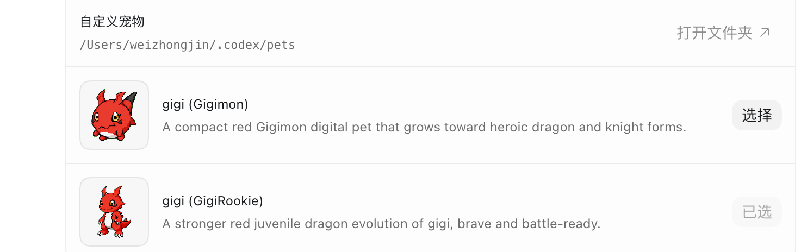

# Hatch Evolution Pet

[English](README.md) | [简体中文](README.zh-CN.md)

一个可以替代 [`hatch-pet`](https://github.com/openai/skills/tree/main/skills/.curated/hatch-pet) 的可进化 Codex pet skill。

`hatch-evolution-pet` 保留原本 Codex pet 的生成流程，同时加入本地 XP、等级、进化状态、形态历史和已解锁形态。Codex Desktop 不需要改动：每个形态仍然是 `~/.codex/pets/` 下的普通可选 pet 包。

## 功能

- 可替代 `hatch-pet` 的进化版 pet skill。
- 根据每天 Codex 使用情况获得 XP 和等级。
- 支持用户定制进化方向，而不是固定写死一棵进化树。
- 新形态会作为普通 Codex pet 解锁。
- 老形态和进化形态并存，就像数码宝贝（Digimon）一样，进化后的形态也可以回退。

## 进化示例

| Stage 0 | Stage 1 |
| --- | --- |
|  |  |
| `gigi` / `Gigimon` | `gigi-stage-1` / `GigiRookie` |

两个形态都会作为普通 Codex pet 出现在自定义宠物选择界面：



## 规则

- Desktop 可选择 pet 包放在 `~/.codex/pets/`。
- 运行时状态放在 `~/.codex/pet-machinespace/`。
- 主 ledger 是 `~/.codex/pet-machinespace/evolution-state.json`。
- 进化规则放在 `hatch-evolution-pet/rules/pet-system-rules.md`。
- `AGENTS.md` 只加轻量 hook，指向规则文件。
- 进化是新增形态，不覆盖旧形态。

### XP

pet 会根据每天使用 Codex 的情况获得 XP。使用越多、token 越多，获得的经验越多，但每天有上限。同一天只应该结算一次。

### 生成

- 用 `$imagegen` 生成 base art 和 row strips。
- row 生成必须使用 canonical base 和 layout guides。
- 用 `record_imagegen_result.py` 记录生成结果。
- 不要手动编辑 `imagegen-jobs.json`。
- 不要直接把图片复制进 `decoded/` 当作捷径。
- 必须检查 contact sheet、QA report、preview videos 和逐行动画连贯性。

## 快速开始

把 `hatch-evolution-pet/` 这个 skill 文件夹复制到 `~/.codex/skills/` 下：

```bash
cp -R /path/to/repo/hatch-evolution-pet ~/.codex/skills/hatch-evolution-pet
```

重启 Codex 或开启一个新对话，让 skill 列表刷新。

然后在 Codex 里使用这个 skill：

```text
[$hatch-evolution-pet](~/.codex/skills/hatch-evolution-pet/SKILL.md)
我要创建一个属于的 pet，我希望他叫小基基，实际是数码宝贝第三部中主角基尔兽的幼年体基基兽。图片可以参考，进化路线参考数码宝贝进化的风格，应该是基尔兽、古拉兽、大古拉兽、红莲骑士兽这样，越来越强，越来越帅。
```

创建提示示例：


这样就够了。skill 会负责初始化 machinespace、收集身份信息、生成基础形象给你确认，然后继续走完整 pet 生成流程。

后续查看经验或进化状态时，直接对 Codex 说“检查我的 pet 经验”或“我的 pet 现在能进化吗？”即可。

## 项目初衷

我们这一代 90 后、95 后，小时候大概率都看过《数码宝贝》。如今我们也从“被选召的孩子”的年纪，长到了及川悠纪夫、山木满雄和李镇宇他们那样的大人年纪。

但当我第一次看到 Codex pet 那种小小的像素风形象时，脑子里第一时间闪过的，还是基尔兽诞生的那一幕。那一刻我突然觉得，真正的数码世界好像已经来了。它和小时候动画里的形式并不一样，但心里那个童年的梦想被唤醒：想拥有一个真正属于自己的数码伙伴，一个会陪伴自己、和自己一起成长的 AI 伙伴。

这个项目就是从这种感觉里开始的。它唤起了我小时候关于数码世界的想象，也让我觉得，这也许只是一个很小的开始。

更希望未来能有更多人一起，在 AI 时代里，亲手打造一个属于新时代、也属于大家的数码世界。
